### Ушаков Александр, М4275

1. Задание 1. Kernel and Module Inspection (15 баллов).

    - Продемонстрировать версию ядра вашей ОС

      Ядро `Linux 6.12.43+deb13-arm64`

      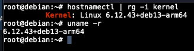

    - Показать все загруженные модули ядра

      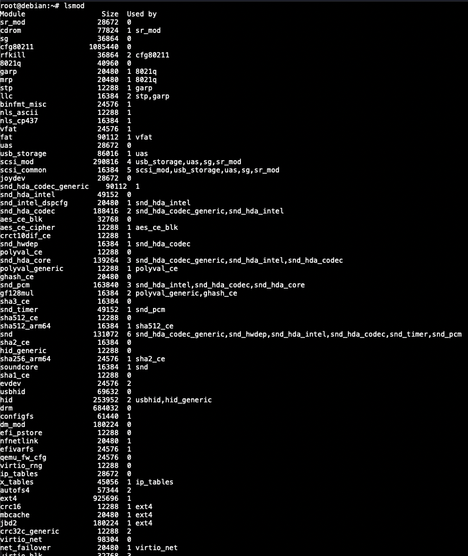

      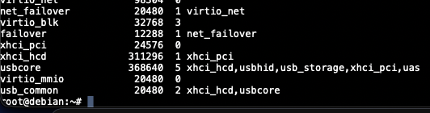

    - Отключить автозагрузку модуля `cdrom`

      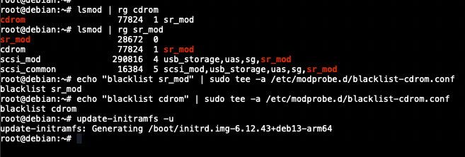

      После перезагрузки наблюдаем отсутствие модулей

      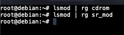

    - Найти и описать конфигурацию ядра (файл конфигурации, параметр `CONFIG_XFS_FS`)

      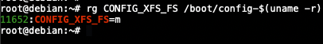

      Значение параметра `m` означает, что файловая система `XFS` поддерживается, но через отдельный модуль

2. Задание 2. Наблюдение за VFS (20 баллов)

    - Используйте `strace` для анализа команды `cat /etc/os-release > /dev/null`. Для этого
      запустите `strace -e trace=openat,read,write,close cat /etc/os-release > /dev/null`

      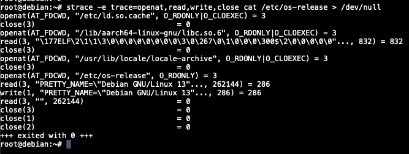

    - Описать открываемый и читаемый файл, объяснить отсутствие записывающих вызовов в выводе

        - сначала служебные вызовы libc и т.д.
        - `openat(AT_FDCWD, "/etc/os-release", O_RDONLY) = 3` - открытие файла на чтение, вернулся файловый
          дескриптор `3`
        - `read(3, "PRETTY_NAME=\"Debian GNU/Linux 13"..., 262144) = 286` - прочитали через этот дескриптор 286 байт
        - `write(1, "PRETTY_NAME=\"Debian GNU/Linux 13"..., 286) = 286` - записываем прочитанные 286 байт, однако вывод
          перенаправлен в `/dev/null`, поэтому он уничтожается
        - `read(3, "", 262144) = 0` - считываем конец файла
        - `close(3) = 0` - закрываем файл

      Можно наблюдать один `write` в выводе `strace`, однако непосредственно вывода в `stdout` нет, поскольку он
      перенаправлен в `/dev/null`

3. Задание 3. LVM Management (40 баллов)

    - Добавить к своей виртуальной машине диск `/dev/sdb` размером `2GB`

   Диски называются `/dev/vda` (основной) и `/dev/vdb` (новый на `2GB`), из-за специфики работы гипервизора `UTM`

   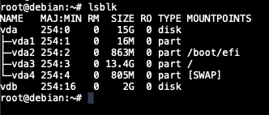

    - Создать раздел на `/dev/sdb`, используя `fdisk` или `parted`

   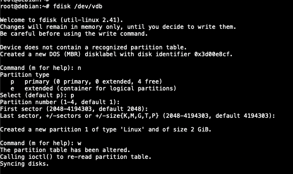

   Видим созданный раздел

   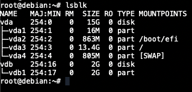

    - Создать `Physical Volume (PV)` на этом разделе

   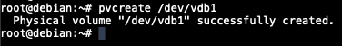

   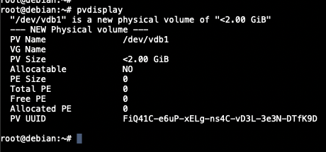

    - Создать `Volume Group (VG)` с именем `vg_highload`

   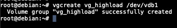

   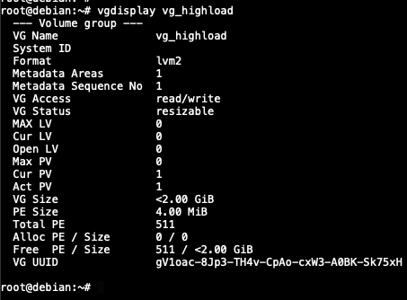

    - Создать два `Logical Volume (LV)`: `data_lv (1200MB)` и `logs_lv (оставшееся место)`

   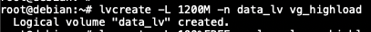

   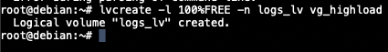

   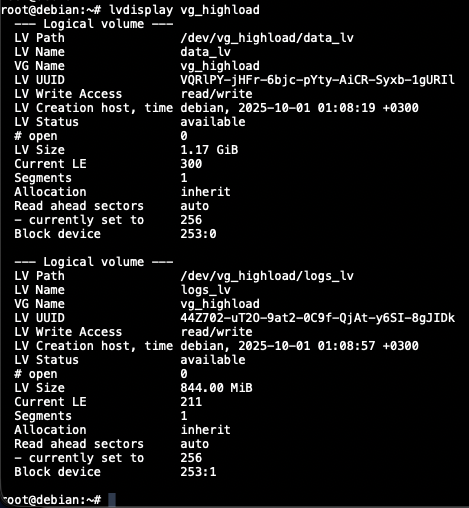

    - Отформатировать `data_lv` как `ext4` и примонтировать в `/mnt/app_data`

   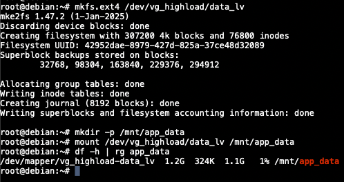

    - Отформатировать `logs_lv` как `xfs` и примонтировать в `/mnt/app_logs`

   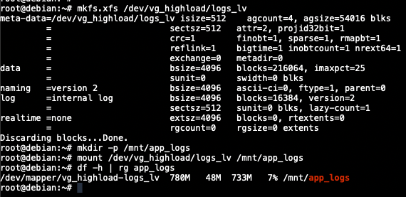

5. Задание 4. Использование pseudo filesystem (25 баллов)

    - Извлечь из `/proc` модель CPU и объем памяти (KiB)

   К сожалению, `arm64` версия Debian не отдает подробную информацию о процессоре из `/proc/cpuinfo` (что замечали и
   пользователи производных от него систем, например Raspberry OS https://github.com/raspberrypi/linux/issues/3991)

   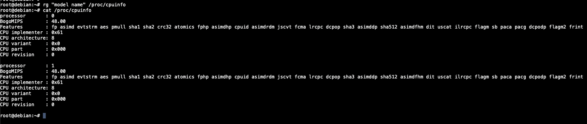

   Поэтому данная команда была повторно выполнена на другом устройстве в WSL

   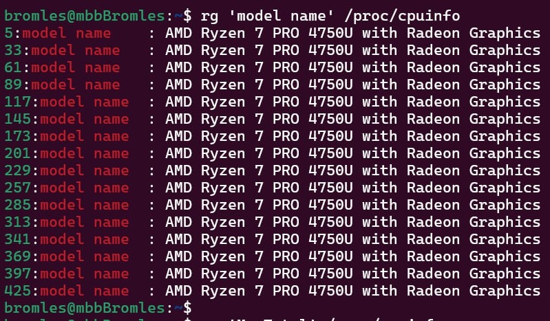

   С `/proc/meminfo` же проблем никаких нет

   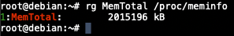

    - Используя `/proc/$$/status`, найдите `Parent Process ID (PPid)` вашего текущего shell. Что означает `$$`?

   `$$` означает `pid` (`Process Id`) текущего shell

   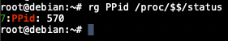

    - Определить настройки `I/O Scheduler` для основного диска `/dev/sda`

   Активный планировщик выделен квадратными скобками. `none` означает, что управление передано контроллеру диска

   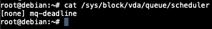

   Видно, что диск считается `HDD` из-за виртуальной машины, хотя на деле находится на физическом `SSD`

   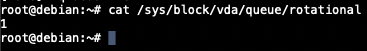

    - Определить размер `MTU` для основного сетевого интерфейса

   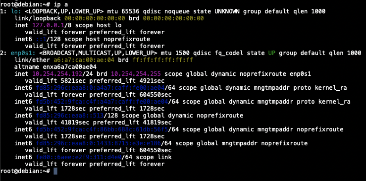

   `MTU = 1500` у интерфейса `enp0s1`
