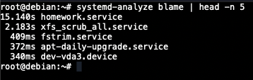

1. Задание 1. Systemd (25 баллов)

    - Создайте bash-скрипт `/usr/local/bin/homework_service.sh` с содержанием
   ```bash
   #!/bin/bash
   
   echo "My custom service has started."
   while true; do
     echo "Service heartbeat: $(date)" >> /tmp/homework_service.log
     sleep 15
   done
   ```

   

    - Создайте systemd unit файл для скрипта, который бы переживал любые обновления системы. Убедитесь, что сервис сам
      перезапускается в случае падения через 15 секунд

   

   Для проверки перезапуска убьем процесс через `kill -9`. Pid сервиса виден в выводе `systemd status`

   

    - Запустите сервис и убедитесь, что он работает

   

   Посмотрим логи

   

    - Используя systemd-analyze, покажите топ-5 systemd unit`ов стартующих дольше всего

   

2. Задание 2. Межпроцессное взаимодействие (IPC) с разделяемой памятью (20 баллов)

    - На любом языке программирования создайте программу, использующую шареную память (создание, ожидание 60 секунд,
      удаление)

   

    - Скомпилируйте и запустите

   

    - Пока программа запущена (60 секунд), проанализируйте вывод - в соседнем терминале запустите `ipcs -m`. Обратите
      внимание на `nattch (number of attached processes)`, проанализируйте вывод

   

   Анализ вывода:
    - `key` - ключ сегмента, полученный через `ftok`
    - `shmid` - идентификатор сегмента, возвращается из `shmget` в коде
    - `owner` - пользователь, являющийся владельцем сегмента
    - `perms` - права доступа к сегменту, задаются при `shmget`
    - `bytes` - размер сегмента, задается в `shmget`
    - `nattch` - количество подключенных к сегменту процессов. В данном случае 0, поскольку мы лишь создали сегмент, но
      не вызывали `shmat` для подключения к нему

3. Задание 3. Анализ памяти процессов (VSZ vs RSS) (20 баллов)

    - Откройте 1 окно терминала и запустите питон скрипт, который запрашивает 250 MiB памяти и держит ее 2 минуты

   `python3 -c "print('Allocating memory...'); a = 'X' * (250 * 1024 * 1024); import time; print('Memory allocated. Sleeping...'); time.sleep(120);"`

   

    - Пока скрипт запущен, откройте вторую вкладку, найдите там PID запущенного скрипта и проанализируйте использование
      RSS и VSZ

   `ps -o pid,user,%mem,rss,vsz,comm -p %%YOUR_PID%%`

   

    - Объясните, почему vsz больше rss, и почему rss далеко не 0

   Vsz (virtual set size) - объем виртуальной памяти, выделенной процессу. Rss (resident set size) - реально занимаемый
   процессом объем памяти. Разница составляет `8536 KB`. Она возникает из-за того, что vsz содержит всё адресное
   пространство процесса, включая его библиотеки, код и т.д., тогда как rss - лишь реально занятые на данный момент
   страницы памяти (например, какие-то библиотеки могут подгружаться лениво лишь при использовании)

   rss не равен нулю, поскольку мы выделили и заполнили данными примерно `250 MB` данных в скрипте, плюс была занята
   память на код, интерпретатор python, и т.д.

4. NUMA и cgroups (35 баллов)

    - Продемонстрируйте количество NUMA-нод на вашем сервере и количество памяти для каждой NUMA-ноды

   

    - Убедитесь, что вы можете ограничивать работу процессов при помощи systemd

   

    - Запустите
   ```bash
   sudo systemd-run --unit=highload-stress-test --slice=testing.slice \
   --property="MemoryMax=150M" \
   --property="CPUWeight=100" \
   stress --cpu 1 --vm 1 --vm-bytes 300M --timeout 30s
   ```

   

    - Будет ли работать тест, если мы запрашиваем 300М оперативной памяти, а ограничиваем 150М?

   Будет, так как у нас включен swap. Превышающая память уходит в него. При отключении процесс бы падал по OOM.

    - В соседней вкладке проследите за testing.slice при помощи systemd-cgls. Превысило ли использование памяти 150М?
      Что происходит с процессом при превышении? Попробуйте использовать разные значения

   

   

   

    - Опишите, что делает и для чего можно использовать MemoryMax и CPUWeight

   MemoryMax нужно для ограничения использования памяти процессом, но без учета swap. Это жесткий лимит из cgroup

   CPUWeight используется для установки относительного веса процесса на планировщике, по сути приоритет процесса. Играет
   роль только при конкуренции процессов за процессорное время