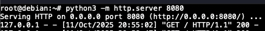
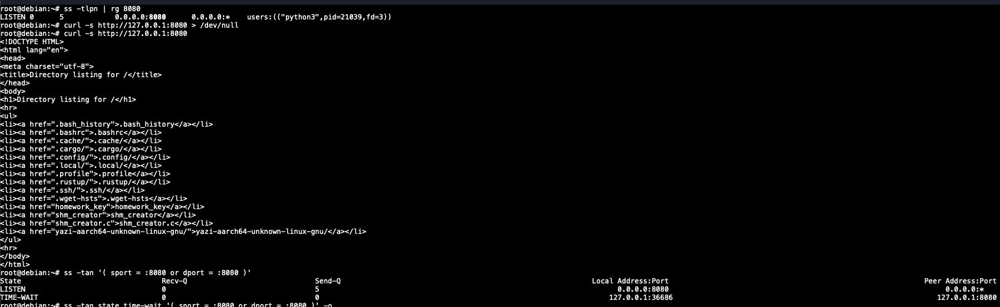
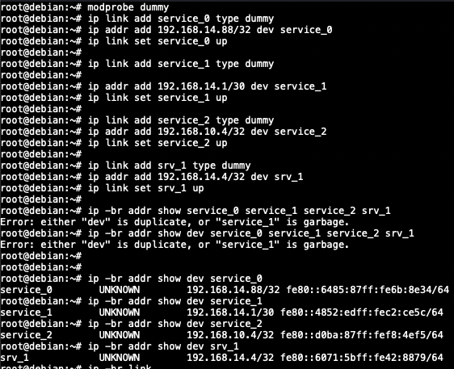
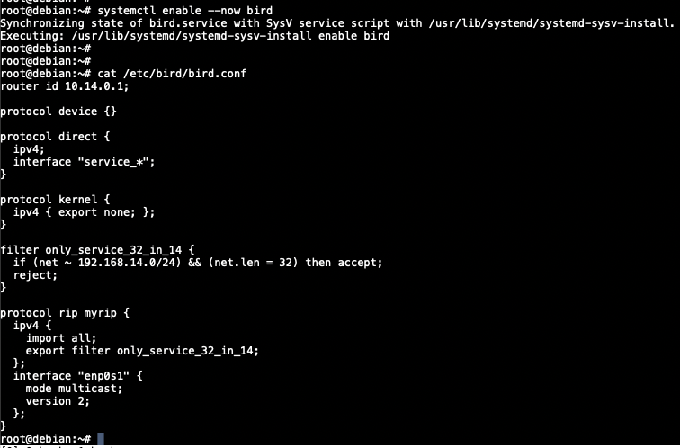
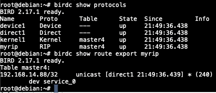
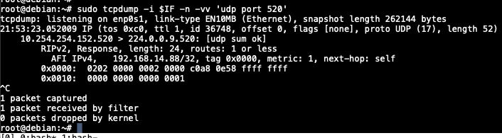
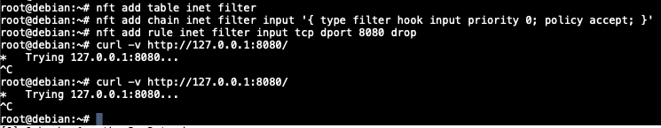
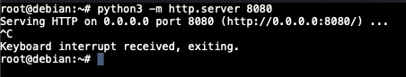
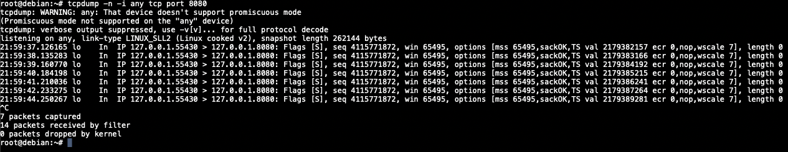
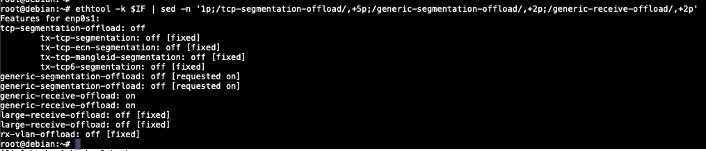

1. Задание 1. Анализ состояний TCP-соединений (25 баллов)

    - Запустите Python HTTP сервер на порту 8080:
      `python3 -m http.server 8080`

   

    - Проверяйте слушающие TCP-сокеты с помощью утилиты ss. Найдите сокет с вашим http сервером

   

    - Проанализируйте состояние TCP-сокетов для порта 8080. Объясните, почему есть сокет в состоянии TIME-WAIT, его роль
      и почему его нельзя удалить.

   Подключились через curl, получили корректный ответ. Через ss проверили сокеты, увидели два в ответе (серверный и
   клиентский).

   TIME-WAIT остаётся у стороны, которая первой закрыла соединение (в данном случае - клиент curl). Это нужно, чтобы
   обработать возможные повторные передачи при закрытии, а также чтобы "потерявшиеся" пакеты не попали в новое
   соединение с таким же идентификатором (src, dst, ip, port).

    - Опишите, к каким проблемам может привести большое количество TIME-WAIT сокетов

        - исчерпание эфемерных портов клиента
        - рост нагрузки на их поддержку (память и тд)
        - лишняя нагрузка на цпу при большом количестве коротких соединений

2. Задание 2. Динамическая маршрутизация с BIRD (35 баллов)

    - Создайте dummy-интерфейс с адресом 192.168.14.88/32, назовите его service_0

   

   Созданы все 4 интерфейса разом

    - При помощи BIRD проаннонсируйте этот адрес при помощи протокола RIP v2, включенного на вашем интерфейсе
      (eth0/ens33), а также любой будущий адрес из подсети 192.168.14.0/24, но только если у него будет маска подсети
      /32 и имя будет начинаться на service_

   

   

    - Создайте еще три интерфейса:
        - service_1 192.168.14.1/30
        - service_2 192.168.10.4/32
        - srv_1 192.168.14.4/32

    - С помощью tcpdump докажите, что анонсируются только нужные адреса, без лишних

   

3. Задание 3. Настройка фаервола / Host Firewalling (25 баллов)

    - С помощью iptables или nftables создайте правило, запрещающее подключения к порту 8080

   

   Использовались nftables как более производительный, современный и рекомендуемый вариант

    - Запустите веб-сервер на питоне и продемонстрируйте работу вашего firewall при помощи tcpdump

   

   

4. Задание 4. Аппаратное ускорение сетевого трафика (offloading) (15 баллов)

    - С помощью ethtool исследуйте offload возможности вашего сетевого адаптера

   

    - Покажите, включен ли TCP segmentation offload

   На скриншоте видно, что TCP segmentation offload выключен, возможно из-за работы в виртуальной машине

    - Объясните, какую задачу решает TCP segmentation offload

   TCP segmentation offload позволяет ядру операционной системы передавать в драйвер сетевого контроллера большой пакет
   данных, чтобы уже тот нарезал его на необходимые для передачи пакеты и добавлял TCP/IP метаданные. Это снижает число
   системных вызовов, а следовательно и ускоряет процесс, и снижает нагрузку на цпу, и повышает пропускную способность.
