1. Задание 1. Создание Server Pool для backend (10 баллов)

    - Создайте у себя в home dir 2 папки - ~/backend1 и ~/backend2, в каждой из которых должен лежать 1 index.html
        - `"<h1>Response from Backend Server 1</h1>"` для backend1
        - `"<h2>*** Response from Backend Server 2 ***</h2>"`  для backend2

   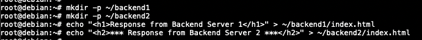

    - Внутри этих папок запустите питоновый http сервер на портах 8081 и 8082 соответственно

   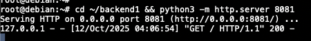

   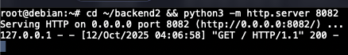

   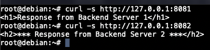

2. Задание 2. DNS Load Balancing с помощью dnsmasq (20 баллов)

    - При помощи dnsmasq создайте 2 A записи
        - `my-awesome-highload-app.local,127.0.0.1`
        - `my-awesome-highload-app.local,127.0.0.2`

   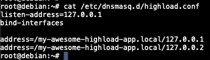

    - Запустите dnsmasq и при помощи dig обратитесь к 127.0.0.1 для резолва my-awesome-highload-app.local

   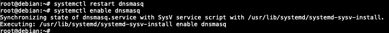

   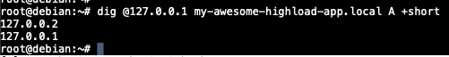

    - Проанализируйте вывод. Что произойдет с DNS записями, если backend2 сервер сломается?

   Ничего не исчезнет само по себе: dnsmasq не делает health-check бэкендов и продолжит отдавать обе A-записи, поскольку
   это просто раунд робин. Клиент попавший на нерабочий адрес (например, backend2 недоступен) увидит ошибку уже на этапе
   подключения. Чтобы DNS динамически исключал мёртвые адреса, нужны внешние проверки, например как с nginx в 4 задании

3. Задание 3. Балансировка Layer 4 с помощью IPVS (35 баллов)

    - Создайте dummy1 интерфейс с адресом 192.168.100.1/32. Используя ipvsadm создайте VS для TCP порта 80, ведущего в
      127.0.0.1:8081 и 127.0.0.1:8082, использующего round-robin тип балансировки.

   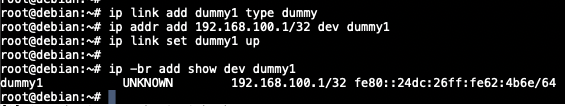

   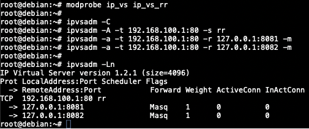

    - Используя curl, сходите в http://192.168.100.1, продемонстрируйте счетчики на ipvs, убедитесь, что балансировка
      происходит

   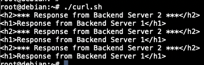

   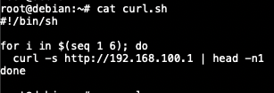

   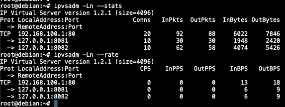

   Изначально в скриптах была допущена ошибка, поэтому после ее исправления они были запущены снова. Отсюда странное
   количество открытых соединений в выводе ipvsadm

    4. Задание 4. Балансировка L7 с помощью NGINX (35 баллов)

        - Создайте пул из 127.0.0.1:8081 и 127.0.0.1:8082 в nginx с active-backup балансировкой

       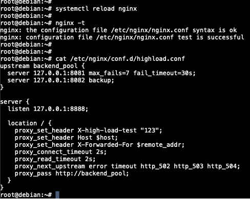

       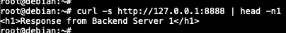

        - Убедитесь, что переключение на backup сервер происходит после 7 неудачных попыток сходить в активный сервер.
          Nginx
          должен слушать только 127.0.0.1 tcp порт 8888 и проставлять заголовок X-high-load-test 123, проксируя в
          апстрим.
          Покажите при помощи tshark http запрос и ответ.

       Запустим на рабочих серверах

       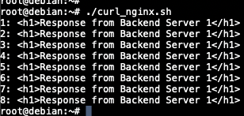

       Выключим backend1

       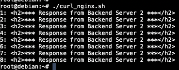

       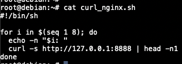

       Запустим tshark

       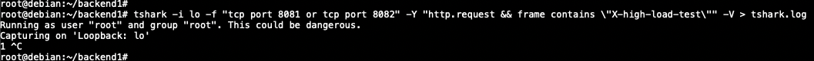

       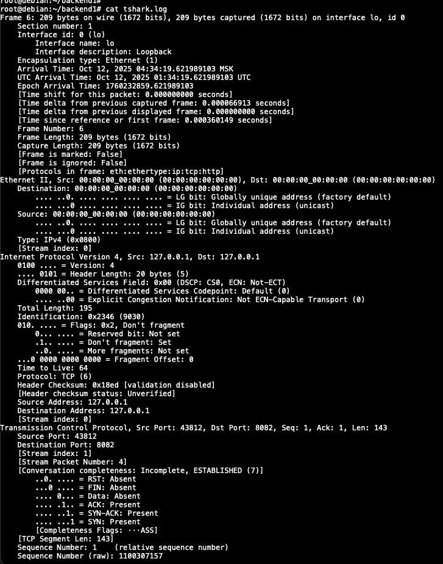

       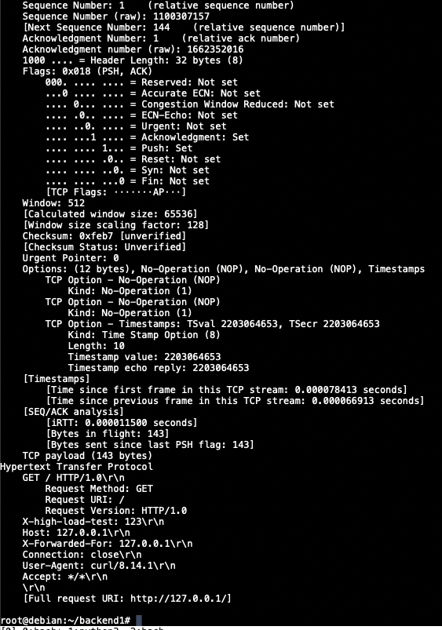

       Видим в ответе наш заголовок
